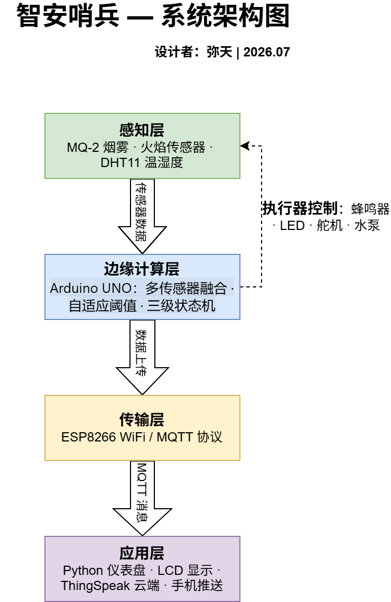
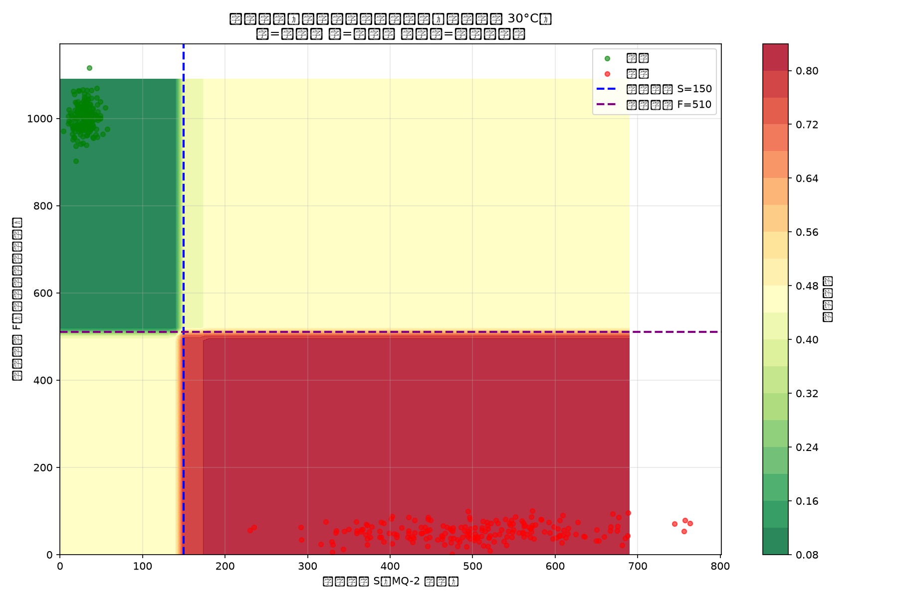
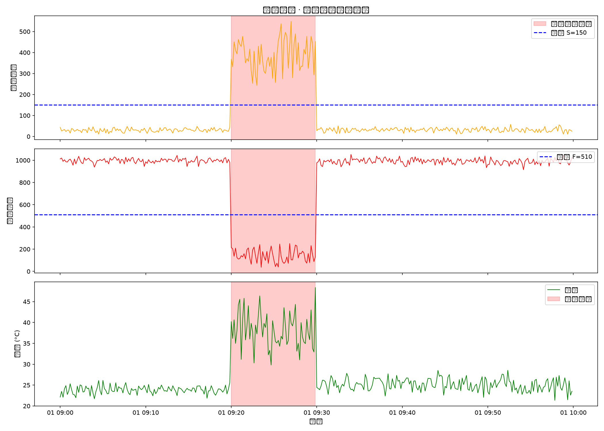

# 智安哨兵 — 智能消防预警系统

## 机器学习：火灾分类器决策边界

> 随机森林分类器 vs 硬阈值对比：模型边界能捕捉特征间的组合关系

## 传感器数据分析

> 360 组模拟数据：烟雾、火焰、温度三路信号在 10 分钟火灾事件窗口内同步跳变

## 真实数据采集与机器学习
基于 Arduino 采集的真实传感器数据（烟雾/火焰），使用随机森林训练火灾分类器。
- [数据集](data/)：正常 30 条 + 火灾事件 29 条（标签经清洗）
- [采集脚本](code/day15_collect.py)
- [分类器](code/day16_real_classifier.py)
> 第一次训练准确率 83%，清洗标签污染后提升至 100% —— 数据质量决定模型质量。

## Python 实时监控端

> tkinter 桌面应用：通过串口实时显示烟雾/火焰/温度/湿度，与 Arduino 联动报警
演示视频：[https://www.bilibili.com/video/BV1sstM6KEAL/?spm_id_from=333.1387.upload.video_card.click&vd_source=ffb1d966e4811d2e76971d9f13d774d3]

## 压力测试报告（4 小时）
| 测试项 | 结果 |
| 运行时长 | 4 小时连续运行 |
| 断线次数 | 0 |
| 误报次数 | 0 |
| 响应延迟 | < 1 秒 |
| 数据量 | 约 14400 条 |
> DHT11 在测试中出现 1 次瞬时读数漂移，因温度在融合算法中仅占 20% 权重，系统正确忽略，未触发误报——验证了多传感器融合对噪声的鲁棒性。
> 设计者：李凌航 | 2026.08
